<h1>3DSSD: Point-based 3D Single Stage Object Detector⁵ (Explained)</h1>

In this blog post, we will explore the paper [3DSSD: Point-based 3D Single Stage Object Detector⁵](https://arxiv.org/abs/2002.10187) published in CVPR 2020.

We will go through the basic concepts that we need to be aware of before delving into the paper's details. Then, I will explain the methodology adopted in the paper in my own words, hopefully, that makes it more understandable. Afterward, we will discuss the results and the suggested enhancements that can be applied to the presented model.

<h2>Background</h2>
<h3>a) Point Cloud</h3>

A point cloud is a scene representation that is different from images. Several sensors can generate point clouds, such as LiDAR. LiDAR generates point clouds where each point can have several dimensions (e.g. x, y, z, and reflectance). Point clouds, unlike images, are order-invariant and sparse, in the sense that a lot of black points can be present in the scene. Thus, to deal with point clouds using deep learning techniques, it won't be a good idea to apply convolutional kernels. As the sparsity and the order-invariance will make the learning process using convolutional kernels totally inefficient.

 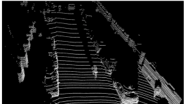 <strong>Sample of Point Cloud (black points indicate how sparse the representation is)¹</strong>  

Thus, several approaches can be followed to deal with point clouds and we will mention them in the next section.

<h3>b) 3D Object Detection</h3>

It is the task of generating 3D bounding boxes around the objects presented in the scene, besides, specifying a label for each generated box.

 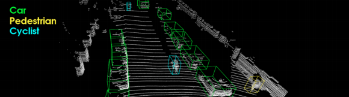 <strong>3D Detection Outputs in a scene¹</strong>  

<h3>c) 3D Detection Strategies</h3>

There are two main approaches to do 3D detection. Either a compact representation approach or a point-based approach.

<h4>Compact Representation Approach</h4>

This approach does not work directly on point clouds. It converts point clouds to a compact representation that would be suitable to apply conventional deep learning techniques on, such as 2d-convolutional kernels. Also, this approach proved to be efficient and fast compared to the point-based approach, however, it suffers from information loss.  
One possible conversion method is called "Voxelization", which divides the point cloud into voxels (grid of voxels) so that each voxel is treated as a single input unit, while each voxel could contain several points. This approach, however, reduces the granularity presented in the point cloud.

 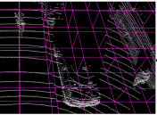 <strong>Voxelization Example¹</strong>  

The other conversion method is called "Projection on 2D space". Either projecting a point cloud to a normal 2D image or to a Bird-eye View (BEV). Both cases will lead to some loss of the information presented in the point cloud (e.g. depth information).

<h5>Voxelization Example: Pointpillars² (~ 62 Frames Per Second (FPS))</h5>
 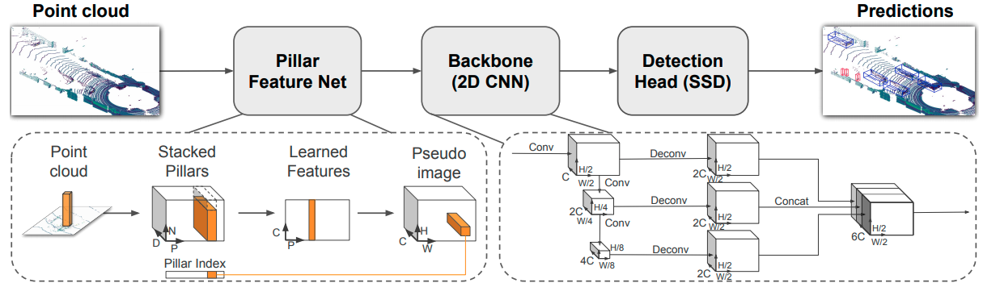 <strong>Pointpillars' architecture²</strong>  

Pointpillars² is a famous single-stage voxel-based 3D object detector, its architecture is presented in the image.  It starts by encoding the point cloud into a Pseudo image so that the rest of the pipeline can apply 2d-convolutional kernels on it. Eventually, they apply a regression head to predict 3D bounding boxes around the objects in the point cloud. They used SSD as the prediction head, for those who are familiar with 2D detection literature they know that SSD is a famous single-stage object detector, thus, the authors of Pointpillars² modified the traditional SSD to predict 3D bounding boxes instead of 2D.

<h4>Point-based Approach</h4>

This approach relies entirely on processing the raw point cloud points and encoding their features using point-net-like³ architectures. This approach generally consists of two stages, which makes its predictions of very high accuracy compared to the compact representation approach. However, having two stages in the inference time can hamper the inference speed of such an approach and making it unfeasible for real-time applications.

<h5>Point-based Example: STD⁴: sparse-to-dense 3d object detector for point cloud (~10 FPS)</h5>

 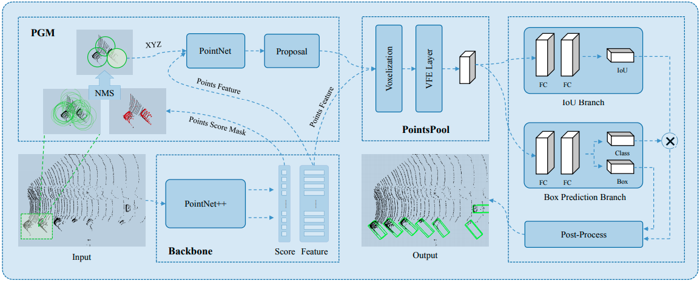 <strong>The Entire STD Network⁴</strong>  

STD is a famous 3D point-based detector that consists of several modules as depicted in the image. In order to understand the functionalities of the two stages that we mentioned above, we have to open the black-box which is called PGM (Proposal Generation Module).

 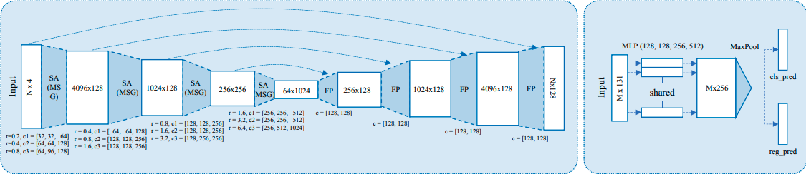 <strong>PGM in STD⁴</strong>  

<strong>First stage:</strong> It consists of Set Abstraction (SA) layers that encode the context features of the point cloud and down-sample the input to have a latent representation of it. Then, the Feature Propagation (FP) layers up-sample the latent-representation obtained from SA layers with the help of skip-connections from higher resolution inputs to restore the missing features during down-sampling and to broadcast the learned features, so it can produce an output which is of more channels than the original input. These extra channels encode the learned features by SA and FP layers. Afterward, a 3D Region Proposal Network (RPN) takes the output of FP layers and generates proposals that might contain objects to be predicted.

<strong>Second Stage:</strong> It consists of a refinement module that refines the outputs of the RPN in the first stage so that the outcomes of the model are refined, hence, accurate.

After deploying such an architecture, it turns out that the FP layers and the refinement module consume half of the inference time, that's why they represent a bottle-neck for point-based methods in general.

<h2>Paper's Motivation</h2>

<strong>Why could not we eliminate the FP layers and the refinement module all at once and still obtain good predictions?</strong>

Let's start answering this question in two points. 
<ul>
<li>D-FPS → the sampling technique adopted in SA layers to down-sample the input is called Farthest Point Sampling (FPS). Meaning that if we choose the first point in our sample, we need the second one to be the farthest point to the previously chosen one, and so on. The farthest point should be distance-wise far, that's why it is called "D-FPS". Bearing in mind, the vast majority of the points in most of the scenes are back-ground points, thus, having the distance as the only sampling metric will lead to down-sample a lot of background points. Also, if we have foreground instances to be detected which have small scales (fewer interior points), any of their interior points is unlikely to be contained in the sample generated by D-FPS.</li>
<li>FP layers & skip-connections → both components come to mitigate the problem aroused from D-FPS, since FP layers with the help of skip-connections can recover and broadcast the missed information during the down-sampling phase. As a consequence, the RPN and the refinement module can generate accurate bounding boxes without a significant loss of information.</li>
</ul>

<h2>Paper's Contribution</h2>

In order to eliminate FP layers and the refinement module, and still obtain good accuracy and precision, new approaches should be devised. 
Thus, the authors of the paper decided to tackle the challenge and come up with a new approach that can be presented in 4 points:
<ol>
<li>Sampling Strategy (Fusion Sampling (FS))</li>
<li>Candidate Generation (CG) Layer</li>
<li>Anchor-free Regression Head</li>
<li>3D Center-ness Assignment Strategy</li>
</ol>

<h3>Fusion Sampling</h3>

As we discussed D-FPS, now we introduce F-FPS and F refers to Feature. Thus, F-FPS samples the points that are semantically dissimilar to each other. The exciting thing is that F-FPS includes the distance into the sampling strategy. In other words, we obtain points that are not close to each other and also semantically dissimilar. 
Let's get an example to understand why it does make sense to add the distance metric into account along with the feature similarity?  
Consider a car, which has points around its wheels are semantically different from the points around its windows, thus, if we just focused on semantic dissimilarity, we might end up having several points from the same car in our sample which represent redundancy in our data since all these points at the end refer to the same foreground instance, which is the car.

 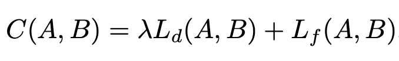 <strong>F-FPS formulation⁵</strong>  

Having that the back-ground points are so similar semantically, that would prevent F-FPS from sampling a lot of back-ground points. As a consequence, the receptive field of background points would be comparable in size with the receptive field of the foreground points. This behavior is good for the regressor as now the regressor trains mainly on the foreground points, but it also hampers the classification performance as the classifier can't distinguish between foreground and background points.

Here, Fusion Sampling comes to the rescue. It proposes that if we will sample M points out of N points. Then, M/2 points come from F-FPS (which represent mostly the foreground points) and M/2 points come from D-FPS (which represent mostly the background points).

 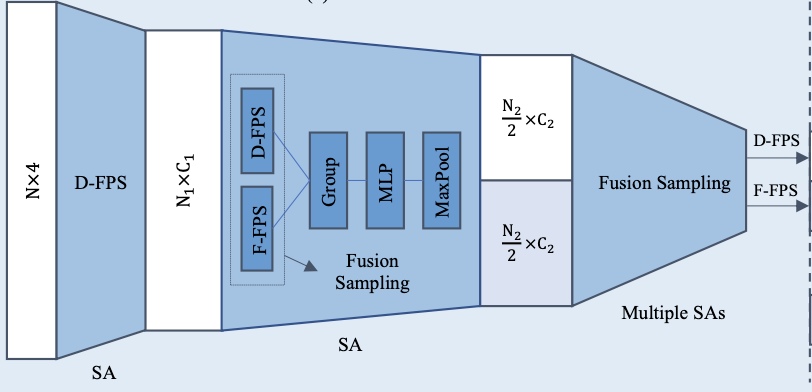 <strong>Fusion Sampling in the Backbone of the architecture⁵</strong>  

<h3>CG Layer</h3>

 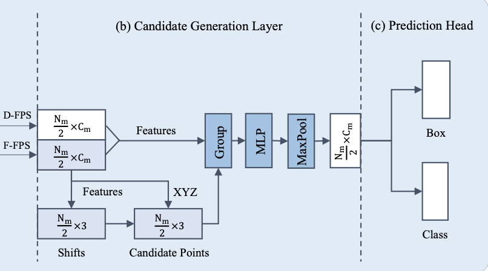 <strong>Candidate Generation Layer⁵</strong>  

It starts by considering just the points sampled by F-FPS, since they mostly present foreground points. It passes these points to a regressor to predict some shifts for each point. Then, it adds these shifts to the corresponding points in F-FPS, so the output points are called candidate points. These candidate points represent the centers of the objects to be detected in the scene.  
In the grouping layer, each candidate point would be surrounded by its neighboring points (from D-FPS & F-FPS) according to a predefined threshold to constitute a group. All the points in each group concatenate their normalized locations along with their context features to form one big vector that is passed to an MLP network to encode its patterns, then passing it to the regressor.

<h3>Anchor-free Regression Head</h3>

Anchor-free regressor means that given a vector of N points where each point has its own encoding and passing it to the regressor, the regressor will generate N bounding boxes. Thus, this component generates a bounding box for each group created in the CG layer, as each candidate point represents a foreground instance's center. 

The regressor outputs are:
<ol>
<li>(dx, dy, dz) which are the offsets between candidate points' positions and the GT centers' positions.</li>
<li>(dl, dh, dw) which are the sizes of the foreground instances.</li>
<li>Orientation Angle of the bounding box.</li>
</ol>

The orientation angle is computed using orientation angle regression, which is a hybrid of classification and regression formulation. It can be simply understood as each object has 360 degrees around it, so they will be divided into N bins, where N = 12. Each bin will represent a class, thus, there would be a classifier to classify to which bin the bounding box belongs and there would be a regressor that predicts the residual value of the orientation angle for each bin.

 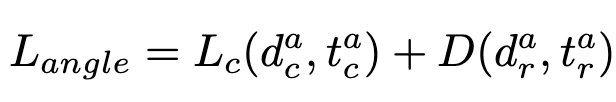 <strong>Orientation Angle Regression Formulation⁵</strong>  

<h3>3D Center-ness Assignment</h3>

This component is meant to reduce the number of false positives generated by the detector. It does so by reducing the classification scores of the bounding boxes that have centers far away from the GTs' centers. In addition to that, it ideally maintains the classification scores of the bounding boxes with centers aligned with GTs' centers. It is applied to the candidate points since the model treats them as the foreground instances' centers.

 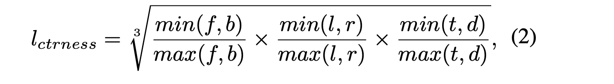 <strong>where (f, b, l, r, t, d) represent the distance to the front, back,
left, right, top, and bottom surfaces of its corresponding instance, respectively⁵</strong>  

final center-ness label = l_ctrness * l_mask,  
where l_mask is a binary flag that represents either the candidate point belongs to a foreground instance or not, and l_ctrness measures how close the bounding box's center from the GT's center.

<h2>Loss Function</h2>

 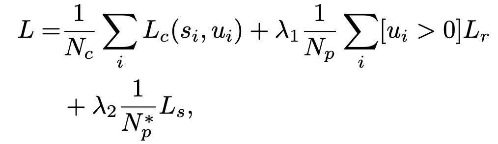 <strong>General Loss Function of the model⁵</strong>  

N_c, N_p, and N*_p refer to the number of candidate points, positive candidate points, and positive points in F-FPS in the CG layer, respectively. 
L_c is CE loss, where s_i and u_i refer to the classification score and the center-ness score, respectively. 
L_r is composed of all the regression losses (dist. to the center, size of the instance, angle regression loss, and corners of the bounding box). 
L_s is the shift loss that can be computed in the CG layer.

<h2>Results (3DSSD⁵ ~ 25+ FPS)</h2>

The model has been tested on both KITTI Dataset and nuScenes Dataset.

<h3>KITTI Dataset</h3>

 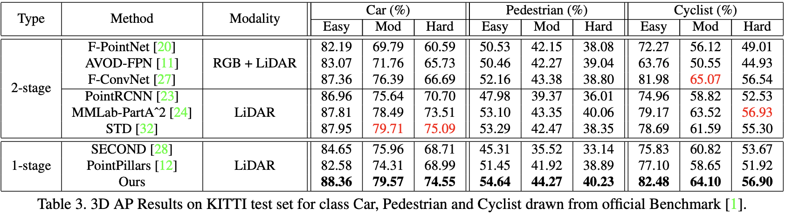  

It has been tested on the test set of the KITTI benchmark, and it outperforms all single-stage compact-representation methods in terms of Average Precision (AP) for each class in the dataset. It outperformed some 2-stage methods in terms of AP in some of the classes' difficulties and for those that it did not outperform, it has a comparable performance with them as depicted in the table. <strong>Bearing in mind, 3DSSD's inference time is at least 2x faster than the fastest 2-stage point-based method.</strong>

<h3>nuScenes Dataset</h3>

 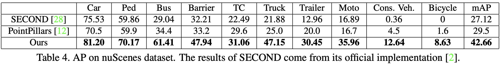  

The model has been tested on the nuScenes test set, which is a more complex dataset compared to KITTI.
Again, the model outperforms the compact-representation methods by far in both AP per class and the overall mean AP (mAP).

<h2>Ablation Studies</h2>

The ablation studies were conducted on the validation set of the KITTI dataset, according to the split mentioned in Voxelnet¹. The AP displayed indicates the Car class with a moderate difficulty level.

<h3>Effect of Fusion Sampling</h3>

 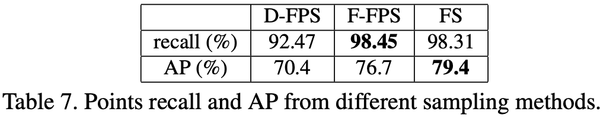  

As depicted in the table, FS improved the AP over both D-FPS and F-FPS, while maintaining a very good points recall score.

<h3>Effect of Shifting in the CG layer and the 3D center-ness assignment</h3>

 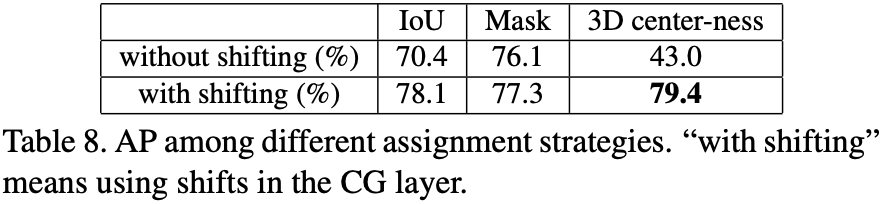  

Regardless of the assignment strategy, shifting always improves the AP. Also, combining shifting with 3D center-ness produced the best AP.

<h2>Future Work</h2>

 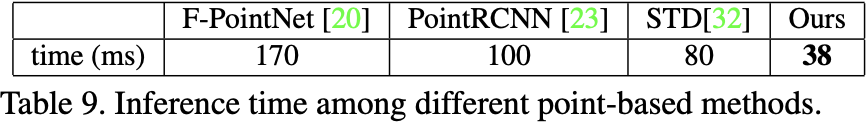  

As mentioned before, the model's inference time outperforms by far all the 2-stage point-based methods.

However, Pointpillars² still can process up to 62 FPS, which is significantly faster than 3DSSD⁵. Thus, adopting implementation optimization (e.g. TensorRT) might help in making 3DSSD even faster, also TensorRT has been adopted in Pointpillars².

<h3>A suggestion for improvement from my perspective</h3>
<ol>
<li>Training the entire network following the same scheme mentioned in the paper.</li>
<li>Freezing the weights of the last SA layer, CG layer, and the regression head.</li>
<li>Fine-tuning the earlier SA layers in the pipeline, by letting them pass their outputs directly to the CG layer and then to the regression head. Then, back-propagating the detection losses.</li>
</ol>

This way the training time might be a bit longer, but the inference time would be the same as before. However, after fine-tuning, the SA layers would pay higher attention to the scene details and that would contribute to more accurate final results.

<h2>Conclusion</h2>

To sum up, I believe this paper proposed a very novel sampling technique that helped to erase an indispensable component like FP layers from a network while maintaining accuracy and precision to a great extent. This paper could be thought of as an effective step towards applying point-based methods in real-time applications with high precision. Given its simple and novel approach, I think that we will see 3DSSD+ and even 3DSSD++ in the next few years. 

<h2>References</h2>
<ol>
<li>Zhou and Oncel Tuzel. Voxelnet: End-to-end learning for point cloud based 3d object detection. CoRR, 2017</li>
<li>Alex H Lang, Sourabh Vora, Holger Caesar, Lubing Zhou, Jiong Yang, and Oscar Beijbom. Pointpillars: Fast encoders for object detection from point clouds. CVPR, 2019</li>
<li>Charles Ruizhongtai Qi, Li Yi, Hao Su, and Leonidas J. Guibas. Pointnet++: Deep hierarchical feature learning on point sets in a metric space. In NIPS, 2017</li>
<li>Zetong Yang, Yanan Sun, Shu Liu, Xiaoyong Shen, and Jiaya Jia. STD: sparse-to-dense 3d object detector for point cloud. ICCV, 2019</li>
<li>Zetong Yang, Yanan Sun, Shu Liu, & Jiaya Jia. (2020). 3DSSD: Point-based 3D Single Stage Object Detector. CVPR, 2020</li>
</ol>

